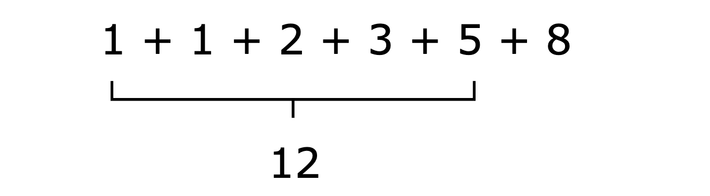
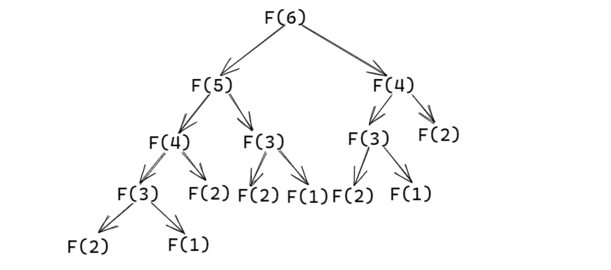
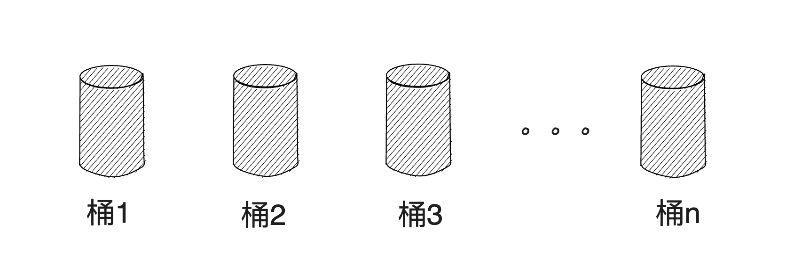

title: 动态规划
speaker: candye
plugins:

    - echarts

<slide class="bg-black-blue aligncenter" image="https://source.unsplash.com/C1HhAQrbykQ/ .dark">

# 动态规划{.text-landing.text-shadow}

By candye {.text-intro}

[:fa-github: Github](https://github.com/GsjzTle){.button.ghost}

<slide :class="size-60 aligncenter">

### 如果我问你这些数组的总和是多少

<br/>


---

我想你会轻松回答我，总和是 $12$ 。{.tobuild.flipInX}

<slide :class="size-60 aligncenter">

### 如果我要在这些数字的右侧再添加一个 $8$

<br>


---

我想你也能轻松回答我，总和是 $20$。{.tobuild.fliplnX}

<slide :class="size-60">

这可能看起来很基础，但我确信你之所以能轻松回答第二个问题，是因为你已经记住了前 $5$ 个数字（子问题）的总和为 $12$。因此，你只需要计算 $12 + 8$ 的和即可。

{.tobuild.flipInX}

这其实就是动态规划的核心思想之一：**通过记忆信息来节省时间（减少计算次数）**。{.tobuild.fliplnX}

<slide :class="size-60">

### 动态规划介绍{.text-landing.aligncenter}

---

动态规划是一种**通过将（复杂的）原问题分解为一系列（较为简单的、可重叠的）子问题，并利用子问题的解来构建原问题的解**的算法思想。

这些子问题只需**解决一次**，并在解决后将它们的解决方案（答案）使用数组或哈希表进行存储。当下次遇到相同的子问题时，不需要重新计算其解决方案，只需查找先前计算的解决方案，从而节省计算时间。

<slide :class="size-60 aligncenter">

 ### 例题：求斐波那契数组的第 $n$ 项

----

给定这样一个数列 $1,1,2,3,\cdots$。数列的第 $1$ 项为 $1$，第 $2$ 项为 $1$，从第 $3$ 项起，每一项都是前两项的和。请问，该数列的第 $6$ 项的值是多少？{.tobuild.fliplnX}

<slide :class="size-60">

显然，要想知道第 $6$ 项的值，就必须得到第 $4$、$5$ 项的值；而要想得到第 $4、5$ 项的值，就需要分别知道第 $2,3$ 项的值，第 $3,4$ 项的值，以此类推。在计算后面的数字（项）之前，总是需要先计算出前面的数字（项）。

若用一棵树来表示每一个数字（项）的依赖关系，则树的形状将大致如下：{.tobuild.fliplnX}

{.tobuild.fliplnX}

其中， $F(i)$ 表示数列第 $i$ 项的值。{.tobuild.fliplnX}

<slide :class="size-60 aligncenter">


---

对此，我们不妨先使用递归的方法来完成每一项的求解。

<slide :class="build size-90">

1. 定义递归函数 `F`，向其传入一个参数 $n$，并返回数列第 $n$ 项的值。

```java
// 伪代码
// 函数名为 F
// 函数需要传入一个参数 n
// 函数的返回值为数列第 n 项的值
F(参数 n){
  return 第 n 项的值
}
```

2. 我们知道，数列的第 $1$ 项和第 $2$ 项的值均为 $1$，因此在函数中，我们可以进行一个特判，即：

```java
// 函数名为 F
// 函数需要传入一个参数 n
// 函数的返回值为数列第 n 项的值
int F(int n){
  if(n == 1 || n == 2) return 1; // 直接返回结果，无需计算。
}
```

3. 而除了第 $1$ 项和第 $2$ 项的值为 $1$ 外，其余每项，均为前两项的和。
   - 那前两项的和分别是多少呢？简单，根据 `F()` 函数的定义，我们可知，前两项的和分别是 `F(n-1)` 和 `F(n-2)`。至于 `F(n-1)` 和 `F(n-2)` 的值究竟是多少，我们无需关心，程序会自动帮我们计算。

```java
int F(int n){
  if(n == 1 || n == 2) return 1;
  else return F(n - 1) + F(n - 2);
}
```

<slide :class="size-60 aligncenter">

:::column {.vertical-align}

```java
int F(int n){
  if(n == 1 || n == 2) return 1;
  else return F(n - 1) + F(n - 2);
}
int main(){
  cout << F(1) << '\n';
  cout << F(2) << '\n';
  cout << F(3) << '\n';
  cout << F(4) << '\n';
  cout << F(5) << '\n';
  cout << F(6) << '\n';
}
```


---


调用 $6$ 次函数 `F`，并分别传入参数 $1,2,3,4,5,6$，可以得到计算结果为：

```text
1
1
2
3
5
8
```

:fa-twitter: 和预期的结果一样。

:::

---

到这，我们便完成了递归方法的求解。{.tobuild.fliplnX}

<slide :class="size-70">

#### 但假如，我们传入的参数不再是 $1\sim6$，而是一个较大的参数 —— $46$。

---

```java{..tobuild..fliplnX}
int F(int n){
  if(n == 1 || n == 2) return 1;
  else return F(n - 1) + F(n - 2);
}
int main(){
  cout << F(46) << '\n';
}
```

再次运行程序，会发现结果无法马上被计算出来。{.tobuild.fliplnX}

这是因为同一个子问题在递归过程中被重复计算了多次。例如，要计算 `F(6)`，我们就需要先计算 `F(5)` 和 `F(4)`，但在计算 `F(5)` 时，我们又需要重新一次计算 `F(4)`，如此这般，`F(4)`会被计算多次，导致计算量呈指数级增长（`F(3)`、`F(2)`、`F(1)` 同理）。{.tobuild.fliplnX}

这也正是递归法低效的原因。{.tobuild.fliplnX}

<slide :class="size-50">

我们可以给函数添加一个计数器 $cnt$，在每次调用函数时使 $cnt$ 的值 $+1$，并在程序结束后打印 $cnt$ 的值，以此来获取程序的计算量（函数的调用次数）。


```java
long long cnt = 0;
int F(int n){
  cnt ++ ;
  if(n == 1 || n == 2) return 1;
  else return F(n - 1) + F(n - 2);
}
int main(){
	F(46);
	cout << "cnt = " << cnt << '\n';
}
```

---

输出的 $cnt$ 的值为 $3672623805$，说明程序的计算量（函数的调用次数）约为 $37$ 亿，十分庞大！{.tobuild.fliplnX}

对此，为了减少程序的计算量，我们就需要引入动态规划的第二个核心思想：**优化重叠子问题**。 {.tobuild.fliplnX}

<slide :class="size-50">


<center style="font-size:40px;font-weight:bold"> 优化重叠子问题 </center>

---

:::column

既然 `F(4)`、`F(3)`、`F(2)`、`F(1)` 会被重复计算多次，那么不妨让我们将它们记录下来，以避免重复计算。

我们可以定义一个足够大的数组 $dp[]$，并将其抽象为若干个桶。对于 `F(i)` 的计算结果，将其存储在第 $i$ 个桶中（在调用函数前，先令数组中所有元素的值初始化为 $0$ 或 $-1$，表示桶中还未存储到任何计算结果）。

---



:::

<br/>

> 当我们计算出 `F(i)` 的结果后，便可将结果保存到 $dp[i]$ （第 $i$ 个桶）中。如果后续过程需要使用到 `F(i)` 的值，我们只需直接从第 $i$ 个桶中取用即可。{.tobuild.fliplnX}

基于上述思路，我们可以对 `F` 函数进行如下修改： {.tobuild.fliplnX}

```java{..tobuild..fliplnX}
int dp[1000]; // 定义为全局变量，使数组中所有元素的初始值均为 0
long long cnt = 0;
int F(int n){
  cnt ++;
  if(n == 1 || n == 2) return 1; // 第 1 项和第 2 项的值是已知的
  if(dp[n] != 0) return dp[n]; // 如果数组 dp 中已经存储了 F(n) 的值，则直接返回 dp[n]
  dp[n] = F(n - 1) + F(n - 2); // 计算F(n)，并保存在数组 dp 中
  return dp[n]; // 返回计算后的值
}
```

<slide :class="size-40">

现在，如果我们再次调用 `F(46)`，程序将会快速返回结果。

```java
...
int main(){
  F(46);
  cout << "cnt = " << cnt << '\n';
}
```

通过计数器 $cnt$ 去获取程序的计算量，可以得到 $cnt$ 的值仅有 $89$。比起原来的 $37$ 亿，极大优化了程序的计算量。{.tobuild.fliplnX}

这种存储计算结果的方法也被称为“**记忆化**”（memoization），它是动态规划的一种实现形式。因为每个子问题只被解决一次，因此原先指数级的时间复杂度可降低至线性级。{.tobuild.fliplnX}

<slide :class="size-40">

不过，记忆化虽然提高了递归的效率，但递归本身还是有一定的内存开销，且递归的层次过深还可能导致栈溢出。

因此，我们可以进一步优化，改用迭代的方式来实现。

```java
int F(int n){
  int dp[1000] = {0}; // 初始化数组，所有元素都设为 0
  dp[1] = dp[2] = 1; // 初始化第 1 项和第 2 项的值
  for(int i = 3; i <= n; i++){ // 从第 3 项开始，用迭代的方式计算每一项的值
    dp[i] = dp[i - 1] + dp[i - 2];
  }
  return dp[n]; // 返回第 n 项的值
}
```

在这种方式下，我们避免了递归带来的问题，并且保持了动态规划**优化重叠子问题**的特点。{.tobuild.fliplnX}

> 至此，我们完成了动态规划的入门。{.tobuild.fliplnX}

<slide :class="size-60">

## 总结{.text-landing.aligncenter}

---

动态规划是一种重要的算法设计思维、技巧，其核心在于：

- 将问题分解为子问题，并找出它们之间的递归关系。
- 储存子问题的解，避免重复计算。
- 自底向上地计算，通常使用迭代方式，以减少递归带来的开销。

---

在算法竞赛中，动态规划能够有效地解决优化问题，提高算法的效率，处理各种复杂约束和依赖关系。

不过，动态规划并不适用于所有的问题，它适用的前提是问题具有**重叠子问题**和**最优子结构**的特点。

> 看到这里，相信你已经能够理解动态规划的基本概念，并能够应用它来解决斐波那契数列问题了。当然，在实际应用中，动态规划的问题和解决方案要复杂得多，需要更深入的理解和更多的练习来掌握。{.tobuild.fliplnX}

